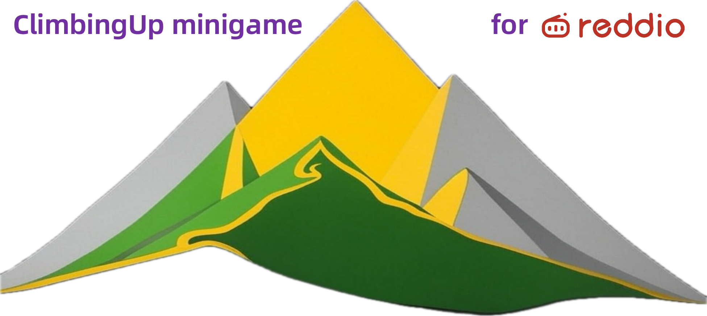

# ClimbingUp@Reddio

A collaborative climbing experiment on the Reddio Devnet blockchain.



## Overview

ClimbingUp@Reddio is an interactive blockchain experiment where users collectively climb to reach new heights together. Each transaction contributes to our global climbing effort, with the goal of passing famous landmarks and reaching unprecedented altitudes.

Built on the Reddio Devnet, this project demonstrates the capabilities of fast blockchain transactions while creating a fun, collaborative experience.

## Features

- **Collaborative Climbing**: Every user contributes to a shared global height
- **Landmark Achievements**: Pass famous global landmarks as the height increases
- **Blockchain Powered**: All climbing actions are recorded on the Reddio blockchain
- **Interactive Visualization**: Watch your climber ascend in real-time
- **Contribution Tracking**: See your personal contribution to the global effort

## How to Play

1. **Connect Your Wallet**:
   - Install MetaMask or another compatible Ethereum wallet
   - Connect to the Reddio Devnet (Chain ID: 50341)
   - Make sure you have some RED test tokens

2. **Climb Up**:
   - Click the "Climb" button to increase the global height by 10 meters
   - Each climb is recorded as a transaction on the blockchain
   - Watch as your climber ascends and the background changes

3. **Descend (Optional)**:
   - Click the "Descend" button to decrease the height
   - This requires a small amount of RED tokens (0.1 RED per 10 meters)
   - Descending can be strategic to reach specific landmark heights

## Getting Started

### Connecting to Reddio Devnet

To interact with ClimbingUp@Reddio, you'll need to add the Reddio Devnet to your wallet:

- **Network Name**: Reddio Devnet
- **RPC URL**: https://reddio-dev.reddio.com
- **Chain ID**: 50341
- **Currency Symbol**: RED
- **Block Explorer URL**: https://reddio-devnet.l2scan.co

### Getting Test Tokens

You'll need RED test tokens to perform certain actions:

1. Visit the [Reddio Devnet Faucet](https://testnet-faucet.reddio.com)
2. Enter your wallet address
3. Request test tokens
4. Wait for the tokens to appear in your wallet

## Landmarks

As we climb together, we'll pass various famous landmarks:

- **0m**: Global Mean Sea Level
- **124m**: Statue of Liberty (USA)
- **324m**: Eiffel Tower (France)
- **452m**: Petronas Towers (Malaysia)
- **828m**: Burj Khalifa (Dubai)
- **1,000m**: Typical Paragliding Height
- **3,000m**: Average Cloud Layer
- **8,848m**: Mount Everest (Nepal/China)
- **10,000m**: Commercial Aircraft Cruising Altitude
- **35,786m**: Geostationary Orbit

## Technical Details

ClimbingUp@Reddio is built using:

- **Frontend**: React, TypeScript, Styled Components
- **Blockchain**: Solidity Smart Contracts on Reddio Devnet
- **Interaction**: ethers.js for blockchain communication

The project demonstrates:
- Smart contract interaction
- Blockchain event listening
- Web3 wallet integration
- Collaborative blockchain applications

## Development

### Prerequisites

- Node.js (v14+)
- npm or yarn
- MetaMask or compatible wallet

### Local Setup

```bash
# Clone the repository
git clone https://github.com/BuGuanBuLiDeYuan/ClimbingUp-Reddio.git

# Navigate to the project directory
cd ClimbingUp-Reddio

# Install dependencies
npm install

# Start the development server
npm start
```

### Smart Contract Deployment

```bash
# Compile contracts
npx hardhat compile

# Deploy to Reddio Devnet
node scripts/deploy-direct.js
```

## Contributing

Contributions are welcome! Please feel free to submit a Pull Request.

1. Fork the repository
2. Create your feature branch (`git checkout -b feature/amazing-feature`)
3. Commit your changes (`git commit -m 'Add some amazing feature'`)
4. Push to the branch (`git push origin feature/amazing-feature`)
5. Open a Pull Request

## License

This project is licensed under the MIT License - see the LICENSE file for details.

## Contact

Created by [@LongLongLongBTC](https://twitter.com/LongLongLongBTC) - feel free to contact me!

---

*ClimbingUp@Reddio is an experimental project and not affiliated with Reddio officially.*
